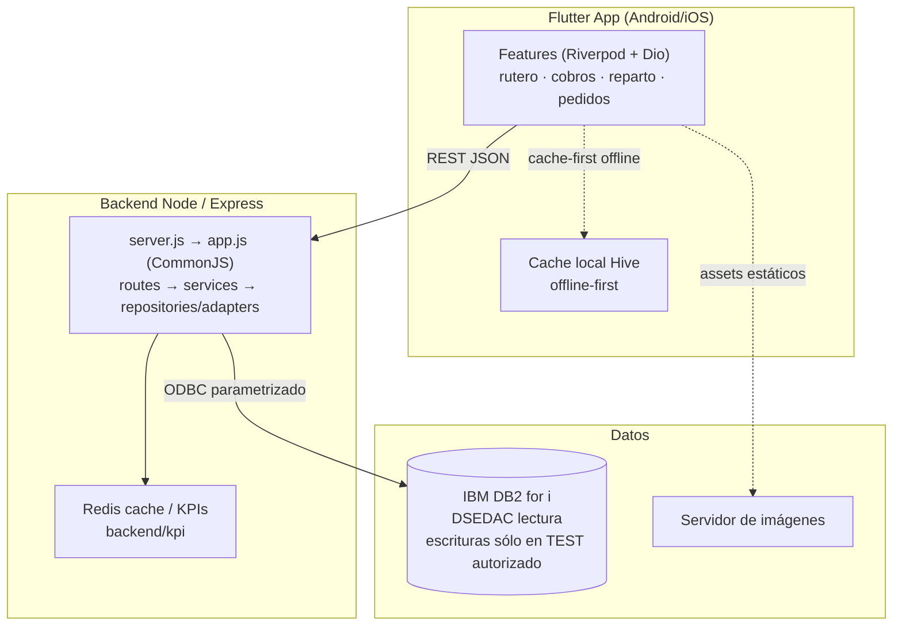

# GMP App Movilidad

App móvil de ventas de campo para Granja Maripepa S.L.: rutero, clientes, cobros, pedidos y reparto sobre datos en vivo de IBM DB2 for i.

> **Tipo de repo**: monorepo con dos unidades desplegables — app Flutter (`lib/`) + API Node/Express (`backend/`). Razón y reglas: [ADR 0001](docs/adr/0001-monorepo-dos-unidades-desplegables.md).

## Arquitectura



Regla dura: **Flutter nunca habla con DB2 ni con servicios internos de datos**; solo con la API (excepción: assets estáticos de imágenes). Detalle en [ADR 0006](docs/adr/0006-cliente-servidor-offline-first.md).

La entrada canónica del backend es `npm start` → `backend/server.js` → `backend/app.js`. Conviven montajes legacy y DDD según configuración. El modo de rutas TypeScript está retirado; `src/` conserva código heredado y algunos scripts de desarrollo que no representan el arranque canónico. El [inventario estático](docs/architecture/runtime-matrix.md) distingue declaraciones, consumidores y casos sin resolver; no acredita por sí solo el montaje efectivo.

## Requisitos

| Herramienta | Versión | Notas |
|---|---|---|
| Flutter / Dart | pin de [`.fvmrc`](.fvmrc), Dart incluido en el SDK | `fvm install` usa la versión fijada |
| Node.js | pin exacto de [`.nvmrc`](.nvmrc) | política local/CI en [runtime-toolchain](docs/adr/runtime-toolchain.md); promoción productiva pendiente |
| Driver ODBC IBM i | instalación y DSN aprobados | sólo para integrar con DB2; las pruebas aisladas no conectan |
| Redis | configuración aprobada del entorno | el modo producción exige sus controles de disponibilidad |

El trabajo de código y las pruebas aisladas no necesitan acceso al negocio. Las integraciones requieren el entorno de test autorizado y, cuando corresponda, LAN/VPN.

## Setup local (primer día)

```bash
# 1. Clonar e instalar tooling de hooks (husky/commitlint/lint-staged)
git clone https://github.com/jlp717/gmp_app_mobilidad.git
cd gmp_app_mobilidad
npm ci                     # usar antes el Node fijado en .nvmrc

# 2. Backend
cd backend
npm ci
# La instalación no requiere arrancar la API ni conectarse a DB2.

# 3. App Flutter (en otra terminal)
cd ..
fvm install
fvm flutter pub get --enforce-lockfile
```

Si no usas FVM, comprueba que `flutter --version` coincide con `.fvmrc`. No regeneres modelos ni actualices locks para ocultar un fallo de instalación: revisa primero el SDK y el diff. Los archivos generados sólo se regeneran cuando cambian sus fuentes, con el comando de codegen indicado más abajo.

Para ejecutar la aplicación contra servicios, Javier debe haber preparado las referencias de entorno y el destino de test. Entonces el comando canónico del backend es `npm start` desde `backend/`; el de Flutter es `fvm flutter run`. El arranque puede inicializar conexiones y tareas: no forma parte del primer test aislado.

## Variables de entorno

Los valores los provisiona el responsable del entorno por el canal autorizado. Las herramientas del equipo no deben abrir ni copiar archivos de secretos. Estos son nombres de configuración, nunca valores reales:

- **Servidor**: `PORT` (3335), `NODE_ENV`, `HOST`
- **DB2 ODBC**: `ODBC_DSN`, `ODBC_UID`, `ODBC_PWD`
- **Esquemas/gates**: `DB2_READ_SCHEMA`, `DB2_WRITE_SCHEMA`, flags fail-closed `REPARTO_*`; lectura en DSEDAC y escrituras exclusivamente en el destino TEST aprobado (ver [ADR 0004](docs/adr/0004-esquema-db2-dsedac-javier.md) y las reglas vigentes en `AGENTS.md`)
- **Auth**: `JWT_ACCESS_SECRET`, `JWT_REFRESH_SECRET`, expiraciones
- **Infra**: `REDIS_*`, pool `DB_POOL_*`, CORS `CORS_ORIGINS`, `LOG_LEVEL`

## Tests

```bash
# Backend — carril explícito sin servicios externos
cd backend
npm run test:unit:isolated

# Flutter — unit + widget
fvm flutter test          # o dart test para suites puras Dart

# Tras tocar modelos/providers Dart:
dart run build_runner build --delete-conflicting-outputs
```

El carril aislado es una selección revisada, no toda la cobertura del backend. `npm test`, `test:ci` y otras suites heredadas conservan su configuración e integraciones: revisa [testing.md](docs/engineering/testing.md) antes de ejecutarlas. Los contratos HTTP, DB2, correo y pruebas de campo requieren sus propios entornos y gates.

Los hooks locales ejecutan Gitleaks sobre lo preparado para commit, comprobación de formato Dart, `node --check` y commitlint. Los tiempos dependen del equipo; un hook verde no sustituye las pruebas funcionales.

## Verificación local

```bash
flutter analyze
dart format --output=none --set-exit-if-changed lib test tool
flutter test
```

El gate de formato se limita a `lib`, `test` y `tool`; excluye `build/` porque contiene artefactos generados. Devuelve código distinto de cero si encuentra fuentes sin formatear.

Los comandos deben ejecutarse y conservar su código de salida; no todos los checks heredados son equivalentes a CI ni están verdes. El [estado de implementación](docs/engineering/implementation-progress.md) registra evidencias y bloqueos; [quality-gates.md](docs/engineering/quality-gates.md) explica los límites del runner. La verificación de rendimiento móvil, ODBC nativo y producción se realiza por separado.

## Despliegue (producción)

Whitelist única, nada más sin aprobación explícita de Javier:

```bash
ssh gmp@192.168.1.230
cd /opt/gmp-api
git pull origin test
pm2 restart gmp-api
curl -A "GMP-SRE-HealthCheck/1.0" http://localhost:3335/api/ready
```

Prohibido sin gate humano: `pm2 set/save/start/reload`, editar el fichero de entorno del servidor, DDL/DML en DSEDAC. Flujo completo y gates: [ADR 0002](docs/adr/0002-pm2-cluster-produccion.md) y `.github/workflows/ci-cd.yml`.

## Estructura

```
├── lib/features/<feature>/{data,domain,providers,presentation}   # app Flutter
├── lib/core/            # infra transversal (api, tema, errores, navegación)
├── backend/{server.js,app.js}    # arranque y composición canónicos
├── backend/{routes,services,repositories,middleware}    # backend CommonJS
├── backend/src/         # módulos heredados y transición; revisar montajes reales
├── scripts/quality/     # checks y pruebas de herramientas sin servicios
├── docs/engineering/    # verificación, baseline y estado de implementación
├── docs/adr/            # decisiones de arquitectura (MADR)
├── docs/audits/         # auditorías puntuales (higiene, seguridad)
└── package.json         # SOLO tooling DX — código de producto NO vive aquí
```

Convenciones de código y reglas del equipo de agentes OpenCode: [`AGENTS.md`](AGENTS.md). Cómo contribuir y política de tamaño de PR: [`docs/CONTRIBUTING.md`](docs/CONTRIBUTING.md).

## A quién preguntar

| Tema | Contacto |
|---|---|
| Owner de todo el repo (CODEOWNERS) | @jlp717 |
| Decisiones de arquitectura | `docs/adr/` — si no hay ADR, se crea antes de merge |
| Reglas del equipo de agentes / automatización | `AGENTS.md` + `.opencode/` |
| Incidencias de producción | Javier (@jlp717) + health `/api/ready` |
