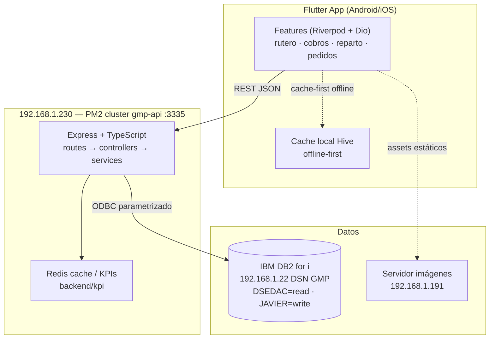

# GMP App Movilidad

App móvil de ventas de campo para Granja Maripepa S.L.: rutero, clientes, cobros, pedidos y reparto sobre datos en vivo de IBM DB2 for i.

> **Tipo de repo**: monorepo con dos unidades desplegables — app Flutter (`lib/`) + API Node/Express (`backend/`). Razón y reglas: [ADR 0001](docs/adr/0001-monorepo-dos-unidades-desplegables.md).

## Arquitectura



Regla dura: **Flutter nunca habla con DB2 ni con servicios internos de datos**; solo con la API (excepción: assets estáticos de imágenes). Detalle en [ADR 0006](docs/adr/0006-cliente-servidor-offline-first.md).

## Requisitos

| Herramienta | Versión | Notas |
|---|---|---|
| Flutter | 3.24+ (pin fvm: ver `.fvmrc`) | `fvm install` usa la versión fijada |
| Node.js | 20 (`.nvmrc`) | CI usa Node 20 |
| Driver ODBC IBM i | instalado + DSN `GMP` creado | requerido por el backend |
| Redis | 6+ | opcional en dev; obligatorio en prod |

Accesos necesarios en dev: LAN del negocio (192.168.1.x) o VPN hacia el servidor API.

## Setup local (primer día)

```bash
# 1. Clonar e instalar tooling de hooks (husky/commitlint/lint-staged)
git clone https://github.com/jlp717/gmp_app_mobilidad.git
cd gmp_app_mobilidad
npm install                # instala tooling raíz y activa git hooks

# 2. Backend
cd backend
npm ci
cp .env.example .env       # rellenar credenciales locales (nunca commitear valores)
node src/server.js         # o npm run start — escucha en :3335
curl http://localhost:3335/api/health   # {"status":"ok",...}

# 3. App Flutter (en otra terminal)
cd ..
fvm install && fvm flutter pub get     # o flutter pub get si no usas fvm
dart run build_runner build --delete-conflicting-outputs   # codegen freezed/riverpod
fvm flutter run
```

Si algo falla: 90% de los problemas de arranque son (a) sin DSN `GMP` local, (b) sin `npm install` raíz → hooks bloquean commits, (c) codegen desactualizado tras pull.

## Variables de entorno

Plantilla canónica con comentarios por variable: [`backend/.env.example`](backend/.env.example). Grupos principales (valores reales NUNCA en el repo):

- **Servidor**: `PORT` (3335), `NODE_ENV`, `HOST`
- **DB2 ODBC**: `ODBC_DSN=GMP`, `ODBC_UID`, `ODBC_PWD`
- **Esquemas/gates**: `DB2_READ_SCHEMA=DSEDAC`, `DB2_WRITE_SCHEMA=JAVIER`, flags fail-closed `REPARTO_*` (ver [ADR 0004](docs/adr/0004-esquema-db2-dsedac-javier.md))
- **Auth**: `JWT_ACCESS_SECRET`, `JWT_REFRESH_SECRET`, expiraciones
- **Infra**: `REDIS_*`, pool `DB_POOL_*`, CORS `CORS_ORIGINS`, `LOG_LEVEL`

## Tests

```bash
# Backend — suite rápida de contratos/perf (lo que corre en pre-push/CI ligero)
cd backend && npm run test:ci

# Backend — todo Jest
npm test

# Flutter — unit + widget
fvm flutter test          # o dart test para suites puras Dart

# Tras tocar modelos/providers Dart:
dart run build_runner build --delete-conflicting-outputs
```

Los hooks locales ejecutan además: gitleaks (secretos staged), `dart format --set-exit-if-changed` y `node --check` solo sobre lo staged (<10s), y commitlint sobre el mensaje.

## Verificación local (= CI)

```bash
flutter analyze
dart format --set-exit-if-changed lib test tool
flutter test
```

El gate de formato se limita a `lib`, `test` y `tool`; excluye `build/` porque contiene artefactos generados. Devuelve código distinto de cero si encuentra fuentes sin formatear.

## Despliegue (producción)

Whitelist única, nada más sin aprobación explícita de Javier:

```bash
ssh gmp@192.168.1.230
cd /opt/gmp-api
git pull origin test
pm2 restart gmp-api
curl -A "GMP-SRE-HealthCheck/1.0" http://localhost:3335/api/ready
```

Prohibido sin gate humano: `pm2 set/save/start/reload`, editar el fichero de entorno del servidor, DDL/DML en DSEDAC. Flujo completo y gates: [ADR 0002](docs/adr/0002-pm2-cluster-produccion.md) y `.github/workflows/ci-cd.yml`.

## Estructura

```
├── lib/features/<feature>/{data,domain,providers,presentation}   # app Flutter (23 features)
├── lib/core/            # infra transversal (api, tema, errores, navegación)
├── backend/src/{routes,controllers,services,middleware,...}       # API TS (19 routers)
├── docs/adr/            # decisiones de arquitectura (MADR)
├── docs/audits/         # auditorías puntuales (higiene, seguridad)
└── package.json         # SOLO tooling DX — código de producto NO vive aquí
```

Convenciones de código y reglas del equipo de agentes OpenCode: [`AGENTS.md`](AGENTS.md). Cómo contribuir y política de tamaño de PR: [`docs/CONTRIBUTING.md`](docs/CONTRIBUTING.md).

## A quién preguntar

| Tema | Contacto |
|---|---|
| Owner de todo el repo (CODEOWNERS) | @jlp717 |
| Decisiones de arquitectura | `docs/adr/` — si no hay ADR, se crea antes de merge |
| Reglas del equipo de agentes / automatización | `AGENTS.md` + `.opencode/` |
| Incidencias de producción | Javier (@jlp717) + health `/api/ready` |
