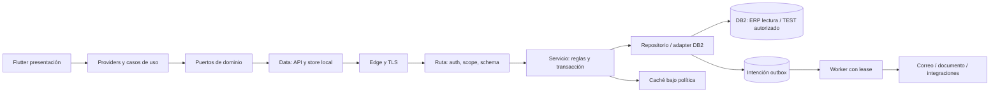

# Arquitectura objetivo y migración

## Decisiones propuestas

Estas decisiones son propuestas para aprobar en los paquetes indicados. No cambian reglas canónicas por el hecho de aparecer aquí.

| Tema | Decisión de partida | Motivo y criterio para reconsiderarla |
|---|---|---|
| Forma de sistema | Monolito modular Flutter + API backend. | El problema observado es coherencia de capas/contratos, no una necesidad demostrada de microservicios. Separar un servicio solo por carga, aislamiento u ownership medidos. |
| Backend | CommonJS activo como referencia; módulos canónicos existentes se conservan. | No mezclar refactor de reglas con migración JS→TS. Una migración de lenguaje exigiría ADR y beneficio comprobable. |
| Datos | DB2 pertenece al backend; Flutter no conoce SQL/DSN/tablas. | Mantener autoridad, permisos, transacciones y tests en un lugar controlable. |
| Flutter | `lib/core` + `features/<f>/{data,domain,providers,presentation}`. | Respetar estructura GMP. No sustituir `providers` por una nueva capa universal. |
| Estado | Riverpod para estado observable; puertos de dominio y adapters explícitos. | Evitar dos fuentes de verdad entre notifier, singleton y widget. Inyección en puntos necesarios, no abstracciones vacías. |
| APIs | Contrato versionado y compatibilidad N/N-1 acordada. | Clientes móviles no se actualizan todos a la vez. |
| Dinero | Precisión por tipo + autoridad del servidor. | Precio/cantidad pueden necesitar más decimales que total. No imponer céntimos a todo campo. |
| Caché | Política por dato, scope y evento; jerarquía medida. | TTL uniforme no resuelve frescura, aislamiento ni write-after-read. |
| Jobs | Outbox/worker cuando deba sobrevivir un commit o reinicio. | `Promise` best-effort no constituye entrega fiable. No añadir un broker si DB2/infra existente cubre la necesidad. |
| Operación | PM2 actual y entrega verificable; contenedores si se mantienen realmente. | No introducir Kubernetes, service mesh o multi-región sin requisito. |

## Límites y flujo

Las flechas representan dependencias y flujo conceptual. No autorizan a añadir tablas, endpoints ni infraestructura. Los nombres físicos se verifican antes de implementar.

Reglas ejecutables:

1. Domain Dart no importa Flutter, Dio, Hive ni providers.
2. Core no importa features. Un feature no accede a detalles internos de otro; usa contrato explícito.
3. Rutas validan/autorizan/delegan; SQL solo en repositorios/adapters backend.
4. Repositorios no importan Express ni widgets, y servicios no escriben la respuesta HTTP.
5. La composición/arranque instancia dependencias; importar un módulo para test no inicia sockets, jobs ni conexiones reales.
6. Una operación con efecto tiene un propietario, una transacción/contrato de recuperación y una respuesta canónica.
7. Un flag selecciona un camino soportado y observable. No se permite fallback silencioso que cambie las reglas de negocio.

## Slices de migración

Para cada dominio se crea una ficha con entrada pública, implementación activa por flag, consumidores, invariantes, cachés, jobs, pruebas y estrategia de retirada. La prueba de paridad no ejecuta dos escrituras para comparar resultados.

Secuencia obligatoria:

1. Caracterizar comportamiento vigente correcto con fixtures sintéticas. Si hay un bug, separarlo y acordar qué resultado debe preservarse.
2. Introducir un seam/fachada estable y pruebas de contrato.
3. Extraer responsabilidad sin modificar DTOs ni semántica. Diff mecánico separado del cambio funcional.
4. Seleccionar implementación de forma explícita en TEST y ejecutar matriz por rol/flag.
5. Comparar lecturas mediante shadow autorizado si es útil; **nunca duplicar una mutación real en shadow**.
6. Promover por cohorte/entorno tras gates. Registrar errores/latencia/resultados y ventana de observación.
7. Retirar implementación antigua únicamente cuando contratos, referencias, clientes y señales de uso lo permitan. La falta de tráfico en una muestra corta no basta.
8. Eliminar el flag de transición y actualizar docs/knowledge/gates de arquitectura.

Primero se estabilizan contratos y componentes transversales. Reparto, cobros, autenticación y liquidación se extraen bajo sus pruebas específicas, sin reinterpretar reglas contables durante la limpieza.

## Responsabilidad por dominio

| Dominio | Frontera crítica | Invariante principal |
|---|---|---|
| Identidad | Alias/código, sesión, refresh, rol/modo y scope. | Un cambio de rol/sesión no conserva permisos ni caché indebidos. |
| Comercial | Pedidos, devoluciones, deuda, liquidación. | CVC/FPG/CAC/CPC y reglas comerciales; separado de validación REPARTIDOR. |
| Reparto | Rutero, entrega, evidencia, cobro y pendientes. | Confirmación conjunta al Finalizar; saldo limitado al documento. |
| Finanzas reparto | Cobros parciales, reversos y cierre. | Suma de fuentes, snapshot y caja consistentes. |
| Reporting | Dashboard, objetivos, comisiones y facturas. | Scope correcto; R1_T8CDVD vs LCCDVD según significado. |
| Almacén | Catálogo/carga/impresión/mapas/3D. | Límites de payload, bridge y permisos de dispositivo. |
| Integraciones | PDF, email, WhatsApp y posibles tools IA. | Contexto autorizado, destinatarios/sink y efectos recuperables. |
| Plataforma | DB2, caché, telemetría, jobs y release. | Recursos acotados, privacidad y operación reproducible. |

## Antiobjetivos

No son objetivos del plan: reescribir toda la app, reemplazar DB2, convertir cada helper en clase, exigir cobertura100% global, borrar plataformas sin decisión, migrar a otra gestión de estado, crear un data lake, ni añadir infraestructura para demostrar sofisticación.

Sí se exige justificar cada dependencia, abstracción y tarea por un riesgo, requisito o medición. Los límites de tamaño/complejidad sirven para detectar hotspots; dividir un archivo arbitrariamente no prueba mantenibilidad.

## Decisiones que deben quedar documentadas

ADR runtime/pines; arquitectura por dominio; protocolo de auth; política TLS/pinning; representación decimal; cache/offline/retención; entrega de outbox; plataformas soportadas; gobernanza de agentes; rama/promoción/artefacto; SLO y DR.

Cada ADR incluye problema, opciones reales, decisión, consecuencias, compatibilidad, fecha, dueño y condición de revisión. No hacer que una decisión sobre auth protegida bloquee pruebas de scope o inventario que se pueden completar independientemente.
