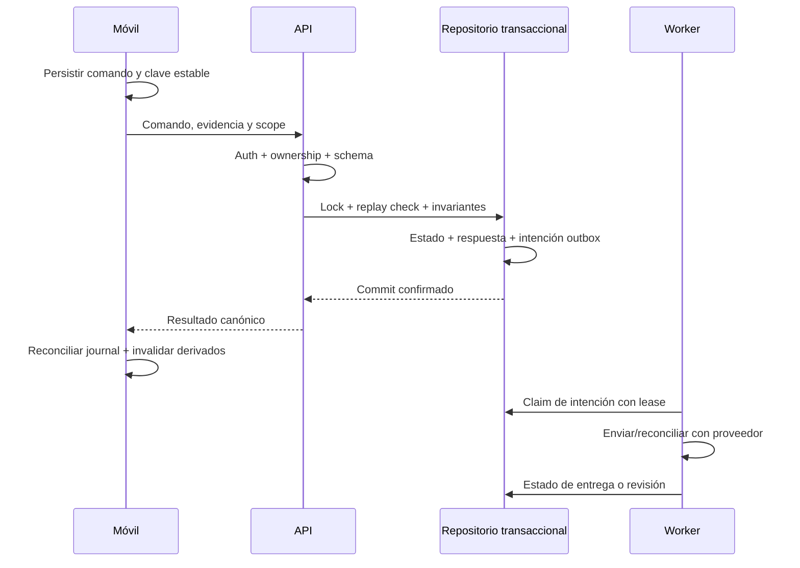

# Datos, caché, concurrencia y rendimiento

## Invariantes que no se negocian en un refactor

- Saldo cobrable de una entrega limitado al importe vivo/CPC del documento, no a la deuda total CVC del cliente.
- Lista, ficha, cabecera, cobro, PDF e impresión coinciden si no cambian cantidades. Con cantidades distintas, precio/totales y liquidación se recalculan con regla aprobada.
- Serie completa visible (por ejemplo P-15-2296), nunca pérdida de una parte del identificador.
- Entrega+cobro se confirman juntos al Finalizar con nombre, apellidos, DNI y firma. No persistir cobro temprano sin esa evidencia.
- Notas de cobro nunca null. Una entrada vacía no debe convertirse silenciosamente en null; validar obligación según contrato de negocio.
- Métodos: Efectivo, Tarjeta, Bizum y Talón. Talón requiere número, vencimiento y banco ENB verificado.
- Cobro parcial deja resto cobrable desde Cobros. Devolución de factura ya cobrada ajusta caja y no descuenta por segunda vez LQD.
- Plazos desde FPG; 30 no es un valor universal.
- Comercial usa DSEDAC CVC/FPG/CAC/CPC para deuda. Objetivo usa R1_T8CDVD; venta/comisión usa LCCDVD. Comercial80 tiene objetivo personal distinto de suma del equipo.
- ALL es alcance autorizado, nunca vendedor literal. JEFE con catálogo grande usa ALL conforme al contrato; líder80 mantiene su equipo.
- RUTERO_CONFIG excluye ORDEN<0. CPC se deduplica conforme a ROW_NUMBER y contrato existente.
- Escrituras solo en TEST autorizado; ERP/DSEDAC es lectura. No se ejecuta DDL/DML para “optimizar” durante una auditoría.

## Política de datos cacheados propuesta

Los números son **puntos de partida para contrastar con negocio/baseline**, no configuración aprobada. El TTL efectivo debe considerar todas las capas; reiniciar el contador al copiar un dato stale entre capas queda prohibido.

| Clase | Servidor | Cliente | Frescura/invalidación y decisión |
|---|---|---|---|
| Sesión/permisos/scope | Store autorizado, TTL de protocolo. | Store seguro, aislamiento por sesión. | Revocación/cambio de rol inmediata según contrato; sin SWR de permisos. |
| Saldo, cobro, entrega viva, cierre | Fuente canónica al confirmar; caché interna solo si invariantes y versión lo permiten. HTTP private/no-store. | Snapshot cifrado para mostrar con edad/estado si negocio lo requiere. | Nunca confirma dinero/evidencia con snapshot. Respuesta canónica invalida derivados. |
| Borrador/operación offline | Journal/idempotencia persistente. | Cifrado, owner, schema y estado explícitos. | No es una caché descartable ni se elimina por TTL. |
| Listado operativo rutero | Candidata frescura15–60s, sin stale para validar mutación. | Mostrar edad/offline y revalidar al operar. | Entrega/cobro/cambio de ruta invalida lista/ficha/badges. Ajustar tras medir. |
| Catálogo/precios | TTL por volatilidad y evento; candidato5–30min. | Snapshot de lectura permitido. | Precio/catálogo sensible se valida otra vez en servidor al comando. |
| Reporting histórico cerrado | Candidato15–60min fresco; stale máximo negociado y visible. | Persistencia cifrada si procede. | Corrección ERP/materialización invalida. Mes abierto usa fuente viva según contrato. |
| Agregado de mes abierto | Menor TTL que histórico, según negocio. | No confundir con dato cerrado. | No responder con rollup TEST obsoleto si contrato exige ERP vivo. |
| Firma/foto/PDF sensible | Acceso autorizado, retención y headers privados. | Temporal seguro para función aprobada. | Nunca cache pública/CDN; limpiar según ciclo de evidencia aprobado. |
| Assets versionados no sensibles | Cache larga por hash si se sirven por web. | Paquete/caché de assets. | Nueva versión/hash sustituye; licencia y origen verificados. |

### Composición de claves

`namespace + environment + dataSchemaVersion + apiPolicyVersion + identityScopeHash + normalizedParameters + generation`.

`identityScopeHash` representa sujeto, rol, modo y conjunto de vendedores autorizado; no es el token. La key no incluye DNI/email/credenciales. Incluir modo y entorno evita mezclar TEST/live o jefe comercial/reparto. Ordenar parámetros/conjuntos canónicamente y conservar semántica ALL.

Cada entrada conserva fetchedAt original, expiresAt, staleUntil, sourceVersion, schemaVersion y scope. El cliente no interpreta que una respuesta vieja recién guardada vuelve a ser fresca.

### Comportamiento ante fallo

1. Fresh válido y autorizado: servir según política.
2. Expirado pero stale permitido: mostrar stale/edad, revalidar con single-flight y deadline.
3. Stale prohibido o demasiado viejo: devolver estado recuperable y no inventar dato vacío/cero.
4. Redis caído: lecturas permitidas pueden hacer bypass acotado; permisos/cuotas siguen decisión fail-closed explícita.
5. Mutación confirmada: integrar respuesta canónica e invalidar derivados. Fallo de invalidación se conserva/reintenta cuando el contrato lo requiere.
6. Cambio de usuario/rol: detener peticiones/cola del contexto anterior; purgar memoria y aplicar política del store cifrado antes de mostrar el nuevo ámbito.

No usar `KEYS` o `FLUSHALL` productivo para arreglar un bug. Preferir tags/generación y límites de cardinalidad. Cada proceso L1 debe converger después de perder pubsub o reiniciar.

## Mutaciones y efectos externos

Si se pierde la respuesta del commit, el móvil consulta/repite con la **misma** clave y payload. No crea un nuevo comando para “intentarlo otra vez”. Si el proveedor externo recibió un email pero se perdió el ack, la transacción DB2 no puede deshacer el correo. Se necesita idempotencia del proveedor, deduplicación o revisión del resultado ambiguo; no se promete exactamente una entrega universal.

Dinero usa escala y rounding definidos por tipo. `double` no implica por sí solo discrepancia existente; FIN-02 primero caracteriza los casos. Precio unitario y cantidad pueden tener precisión mayor de dos decimales, aunque el importe final se liquide a céntimos.

## Presupuestos y medición

Objetivos iniciales **propuestos**, que deben ratificarse tras PERF-01:

| SLI | Candidato inicial | Cómo se verifica |
|---|---|---|
| API de interacción | p95≤500ms backend en carga nominal, salvo operación con presupuesto propio. | Histograma de ruta, tamaño/datos/cache/cola y muestra registrados. |
| Analítica pesada | p95≤1.500ms como referencia inicial. | Frío y caliente separados; no hacer cumplir ocultando queries con HIT. |
| Confirmación financiera | Presupuesto total acordado por etapa, sin prioridad de latencia sobre consistencia. | Commit, respuesta, recibo/outbox y ambigüedad medidos por separado. |
| Frames móvil | Dentro de16,7ms a60Hz o8,3ms a120Hz para build/raster según dispositivo; jank objetivo<1% propuesto. | Profile/release físico y dataset representativo; justificar percentil/muestra. |
| Memoria | Meseta estable en navegación/soak; cero crecimiento no acotado. | Heap/GC/colas antes/durante/después; umbral MB según dispositivo real. |
| Red | Menos bytes/requests por flujo sin perder datos necesarios. | Conteo y payload con misma tarea/dataset; no porcentaje global sin denominador. |
| Disponibilidad | SLO por flujo útil, ejemplo99,5–99,9% pendiente de decisión de negocio. | Ventana y presupuesto definidos; /live no acredita cobro funcional. |
| Recibos/outbox | Edad pendiente y tasa de éxito dentro de objetivo de negocio. | Separar transacción confirmada de documento efectivamente entregado. |

No son promesas contractuales ni pruebas realizadas. No hay baseline física actual de este run. Los valores históricos de otros informes tienen etiquetas distintas y SHAs distintos.

Medir al menos: hardware/OS/build, rol/modo, tamaño de datos, red y RTT, frío total/L2/HIT/40s, edad cache, latencia API/DB/cola/parse/render, error rate y sample size. p99 requiere muchas más observaciones que un pequeño recorrido manual. Conservar incertidumbre y condiciones, no solo un número.

### Orden de optimización

1. Corregir resultados/seguridad y señales de medida.
2. Reducir trabajo innecesario: N+1, payload, queries repetidas, reconstrucciones.
3. Acotar recursos, aplicar cancelación y backpressure.
4. Validar queries/índices con DBA y dataset real autorizado.
5. Ajustar caché mediante contrato de frescura.
6. Escalar procesos/infra solo cuando los datos lo justifiquen y DB2 pueda soportarlo.

Un timeout de JavaScript no demuestra cancelación en IBM i. PERF-03 exige verificar locks/jobs y descartar conexiones de estado incierto; no aumentar timeouts globalmente para ocultar saturación.
